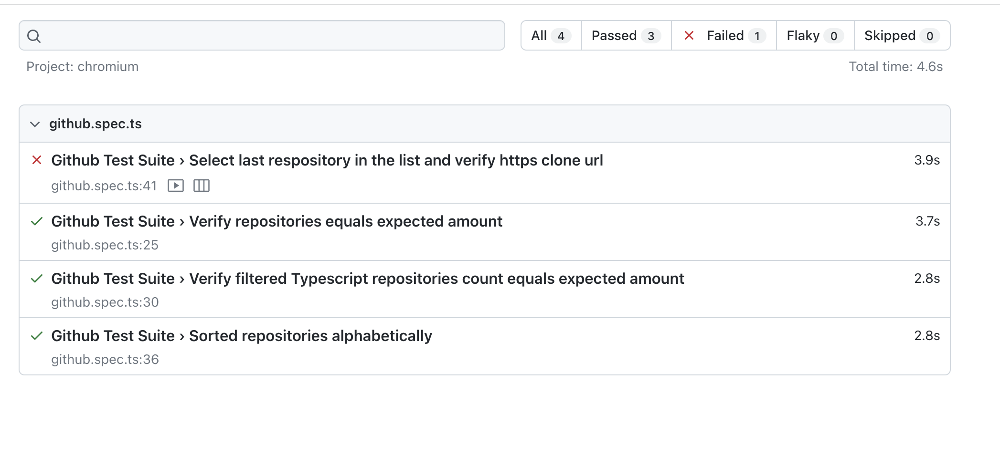
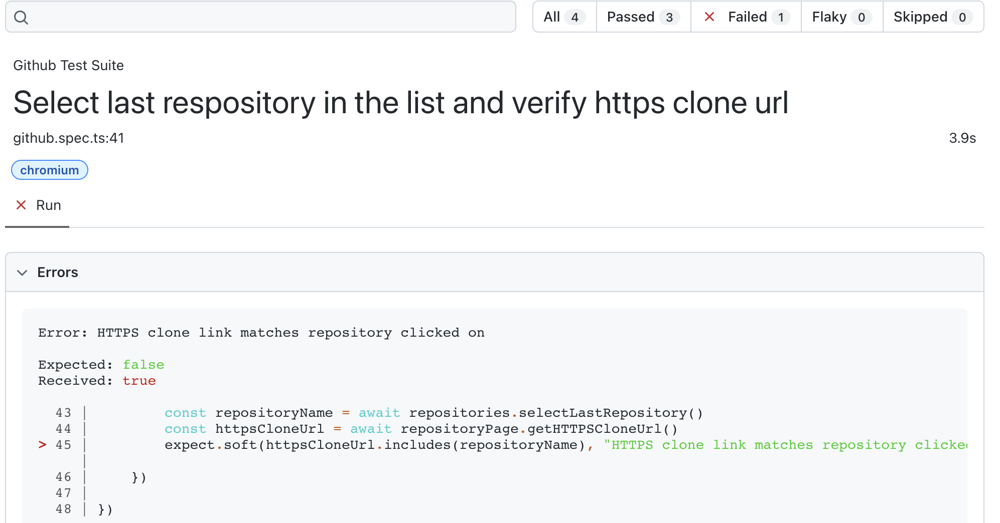

# playwright-github-repositories

## Prerequisites
- node & npm
- git

## Installation
- Clone the repo using the following command: `git clone https://github.com/davidgaribay0/playwright-github-repositories.git`
- Navigate to folder using `cd playwright-github-repositories`
- Install all dependencies `npm i`
- From the same folder you are in run the playwright tests using the command `CI=false npx playwright test`

## Options
- If you would like to see the tests in headed mode (UI visible) run the following command `CI=false npx playwright test --headed`
- If you would like to see the tests in non-headed mode (UI not visible) run the following command `CI=false npx playwright test`
- If you would like to run in CI mode pass in the flag CI=true before the playwright command example: `CI=true npx playwright test`

## Project structure
- This repository follows the Page Object Model (POM) and utilizes playwright and typescript to create automation test cases.
- The framework is data driven and most of the parameters are located the [github.data.ts file](data/github.data.ts), this helps avoid hardcoding test data into test specs for increased mantainability. 


## Example outputs

1. All test passing:
```sh

$: CI=false npx playwright test --headed

Running 4 tests using 4 workers

  ✓  1 [chromium] › github.spec.ts:25:9 › Github Test Suite › Verify repositories equals expected amount (3.7s)
  ✓  2 [chromium] › github.spec.ts:41:9 › Github Test Suite › Select last respository in the list and verify https clone url (3.7s)
  ✓  3 [chromium] › github.spec.ts:30:9 › Github Test Suite › Verify filtered Typescript repositories count equals expected amount (2.8s)
  ✓  4 [chromium] › github.spec.ts:36:9 › Github Test Suite › Sorted repositories alphabetically (2.9s)

  4 passed (4.8s)

To open last HTML report run:

  npx playwright show-report

```

2. In the event of a test failure this is how the html reporter will report on it (Failed intentionally for demo purposes):


Note, the Error message comes from our expect.soft() 
```ts 
expect.soft(httpsCloneUrl.includes(repositoryName), "HTTPS clone link matches repository clicked on").toBe(true)
```